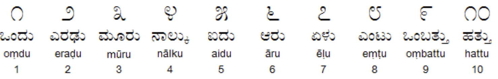

# Application of Transfer Learning for Universal Digit Classification

Artificial/Convolutional Neuronal Networks train to classify digits of one
script (Arabic numerals) and apply transfer learning to classify digits of
another script (Kannada numerals).

Implemented in TensorFlow. Kannada MNIST dataset available here:
https://www.kaggle.com/c/Kannada-MNIST/data

### Geographical Distribution of the Dravidian Language Family

Credit: BishkekRocks, distributed under a CC-BY_SA 3.0 license.

### Kannada MNIST 

Credit: Vinay Uday Prabhu
